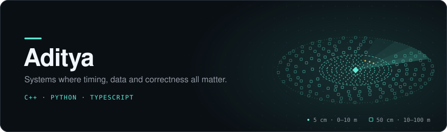
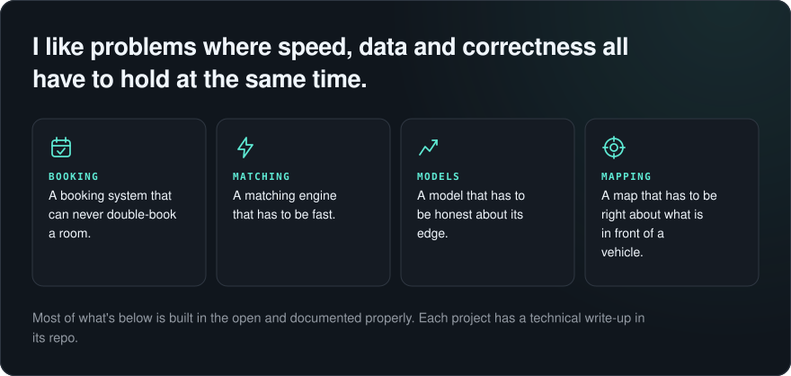
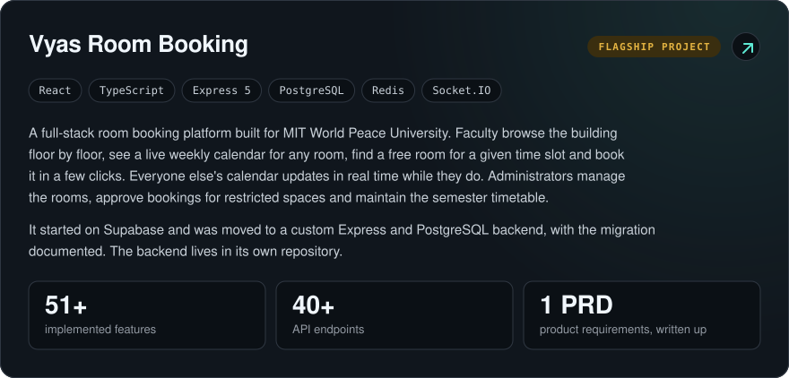
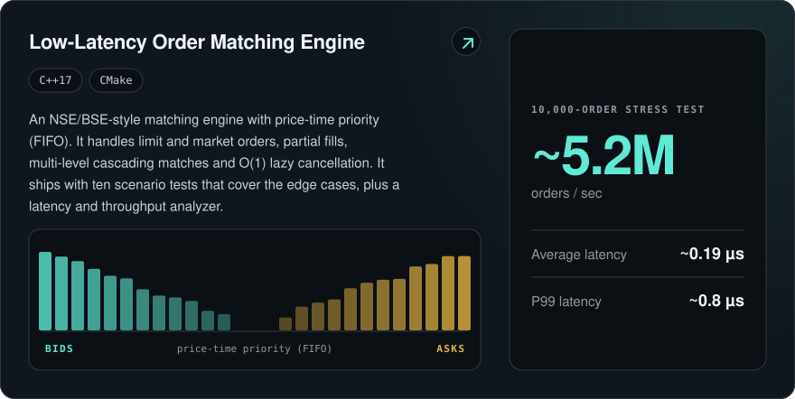
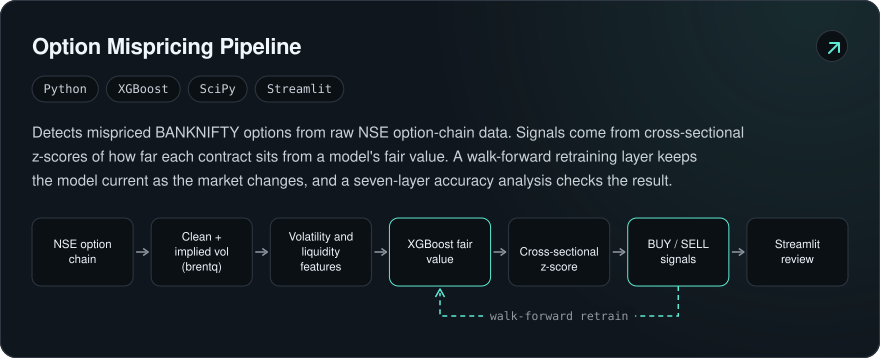
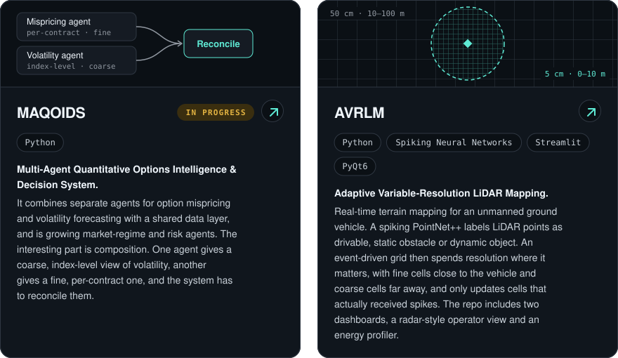
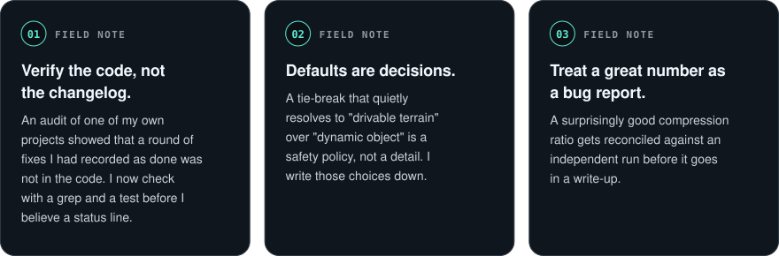
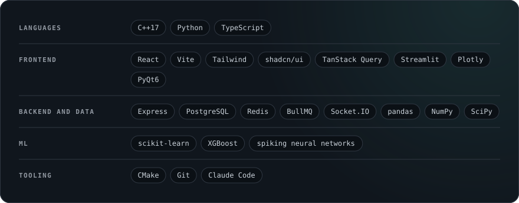

  

 

## Selected work

  <a href="https://github.com/ProgrammerAdi-369/REPLACE-WITH-MAQOIDS-REPO-NAME">MAQOIDS ↗</a> &nbsp;·&nbsp;
  <a href="https://github.com/ProgrammerAdi-369/REPLACE-WITH-LIDAR-REPO-NAME">AVRLM ↗</a>

## Field notes

## Stack

<!--
Add a contact line here when ready, for example:
Reach me: your-email@example.com · LinkedIn: https://www.linkedin.com/in/your-handle
-->
