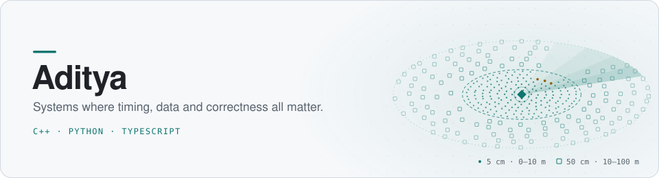

  <picture>
    <source media="(prefers-color-scheme: dark)" srcset="assets/hero-dark.svg">
    
  </picture>

 

I like problems where speed, data and correctness all have to hold at the same time: a booking system that can never double-book a room, a matching engine that has to be fast, a model that has to be honest about its edge, a map that has to be right about what is in front of a vehicle.

Most of what's below is built in the open and documented properly. Each project has a technical write-up in its repo.

---

## Selected work

### [Vyas Room Booking](https://github.com/I-R-I-S-MIT-WPU/Vyas-Faculty-Availability)

`React` · `TypeScript` · `Express 5` · `PostgreSQL` · `Redis` · `Socket.IO`

_Flagship project_

A full-stack room booking platform built for MIT World Peace University. Faculty browse the building floor by floor, see a live weekly calendar for any room, find a free room for a given time slot and book it in a few clicks. Everyone else's calendar updates in real time while they do. Administrators manage the rooms, approve bookings for restricted spaces and maintain the semester timetable.

It started on Supabase and was moved to a custom Express and PostgreSQL backend, with the migration documented. The backend lives in its own repository. The project has 51+ implemented features and 40+ API endpoints, all written up in a product requirements document.

  <picture>
    <source media="(prefers-color-scheme: dark)">
    
  </picture>

 

### [Low-Latency Order Matching Engine](https://github.com/ProgrammerAdi-369/Low-Latency-Order-Matching-Engine)

`C++17` · `CMake`

An NSE/BSE-style matching engine with price-time priority (FIFO). It handles limit and market orders, partial fills, multi-level cascading matches and O(1) lazy cancellation. It ships with ten scenario tests that cover the edge cases, plus a latency and throughput analyzer.

| 10,000-order stress test |                  |
| ------------------------ | ---------------- |
| Throughput               | ~5.2M orders/sec |
| Average latency          | ~0.19 µs         |
| P99 latency              | ~0.8 µs          |

### [Option Mispricing Pipeline](https://github.com/ProgrammerAdi-369/Machine-Learning-Framework-for-option-mispricing)

`Python` · `XGBoost` · `SciPy` · `Streamlit`

Detects mispriced BANKNIFTY options from raw NSE option-chain data. Signals come from cross-sectional z-scores of how far each contract sits from a model's fair value. A walk-forward retraining layer keeps the model current as the market changes, and a seven-layer accuracy analysis checks the result.

### [MAQOIDS](https://github.com/ProgrammerAdi-369/REPLACE-WITH-MAQOIDS-REPO-NAME)

`Python` · _in progress_

A Multi-Agent Quantitative Options Intelligence & Decision System. It combines separate agents for option mispricing and volatility forecasting with a shared data layer, and is growing market-regime and risk agents. The interesting part is composition. One agent gives a coarse, index-level view of volatility, another gives a fine, per-contract one, and the system has to reconcile them.

### [AVRLM: Adaptive Variable-Resolution LiDAR Mapping](https://github.com/ProgrammerAdi-369/REPLACE-WITH-LIDAR-REPO-NAME)

`Python` · `Spiking Neural Networks` · `Streamlit` · `PyQt6`

Real-time terrain mapping for an unmanned ground vehicle. A spiking PointNet++ labels LiDAR points as drivable, static obstacle or dynamic object. An event-driven grid then spends resolution where it matters, with fine cells close to the vehicle and coarse cells far away, and only updates cells that actually received spikes. The repo includes two dashboards, a radar-style operator view and an energy profiler.

---

## Field notes

> **Verify the code, not the changelog.**
> An audit of one of my own projects showed that a round of fixes I had recorded as done was not in the code. I now check with a grep and a test before I believe a status line.

> **Defaults are decisions.**
> A tie-break that quietly resolves to "drivable terrain" over "dynamic object" is a safety policy, not a detail. I write those choices down.

> **Treat a great number as a bug report.**
> A surprisingly good compression ratio gets reconciled against an independent run before it goes in a write-up.

---

<b>Stack</b>

 

|                      |                                                                            |
| -------------------- | -------------------------------------------------------------------------- |
| **Languages**        | C++17, Python, TypeScript                                                  |
| **Frontend**         | React, Vite, Tailwind, shadcn/ui, TanStack Query, Streamlit, Plotly, PyQt6 |
| **Backend and data** | Express, PostgreSQL, Redis, BullMQ, Socket.IO, pandas, NumPy, SciPy        |
| **ML**               | scikit-learn, XGBoost, spiking neural networks                             |
| **Tooling**          | CMake, Git, Claude Code                                                    |

<!--
Add a contact line here when ready, for example:
Reach me: your-email@example.com · LinkedIn: https://www.linkedin.com/in/your-handle
-->
